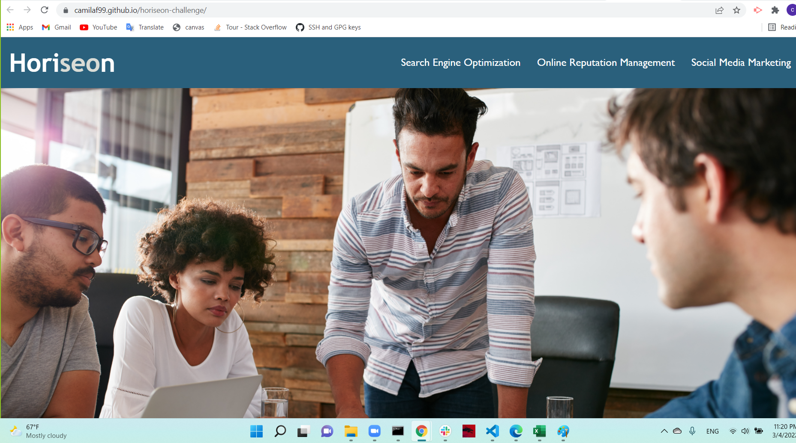

#Your Task
This week is an odd-numbered week, so your Challenge is an on-the-job ticket, which means you'll begin with starter code that you need to modify. This week's challenge involves a very important aspect of web development: accessibility.

One of the most common tasks for front-end and junior developers is to take existing code and refactor it (recall that to refactor code is to improve it without changing what it does) to meet a certain set of standards or implement a new technology. In this Challenge, a marketing agency has hired you to refactor an existing site to make it more accessible.

> **NOTE** 
> Your coursework this week will prepare you with all the skills that you need to succeed on this assignment!

Web accessibility is an increasingly important consideration for businesses. It ensures that people with disabilities can access a website using assistive technologies such as video captions, screen readers, and braille keyboards. Making a website accessible is also good for business for many reasons, one of them being that accessible sites are better positioned in search engines like Google. It also helps companies avoid litigation that can occur when people with disabilities can't access their website.

Even though accessibility is a broad topic that can include complex requirements, your tech lead has given you a small list of specific criteria to satisfy the project. These criteria are documented in the Acceptance Criteria section.

> **IMPORTANT**
> An important rule to follow when working with someone else's code is the Scout Rule, which recommends that you always leave the code a little cleaner than when you found it.

To impress clients, you should always go the extra mile and improve the codebase for long-term sustainability. For example, make sure that all links are functioning correctly. Also, rework the CSS to make it more efficient by consolidating CSS selectors and properties, organizing them to follow the semantic structure of the HTML elements, and including comments before each element or section of the page.

Are you ready to jump in? Here are this week's challenge requirements:

##User Story
```
AS A marketing agency
I WANT a codebase that follows accessibility standards
SO THAT our own site is optimized for search engines
```
##Acceptance Criteria
```
GIVEN a webpage meets accessibility standards
WHEN I view the source code
THEN I find semantic HTML elements
WHEN I view the structure of the HTML elements
THEN I find that the elements follow a logical structure independent of styling and positioning
WHEN I view the image elements
THEN I find accessible alt attributes
WHEN I view the heading attributes
THEN they fall in sequential order
WHEN I view the title element
THEN I find a concise, descriptive title
```
##Mock-Up
> **NOTE**
> This layout is designed for "desktop", so you may notice that some of the elements don't look like the Mock-Up when viewed at a resolution smaller than 768px. In future lessons, you will learn how to make elements "responsive" so that your web application is optimized for any screen size.

The following image shows the web application's appearance and functionality:



A webpage titled "Horiseon" features a navigation menu in the header, a hero image, various sections, and more.

##How to Complete the Challenge
Follow these steps to complete the challenge:

1. Clone your [starter code](https://github.com/coding-boot-camp/urban-octo-telegram)

2. Refactor the code to meet the Acceptance Criteria.

3. Make sure your work meets the full list of grading requirements.

4. Follow the instructions to submit your Challenge for review.

##Grading Requirements
This challenge is graded based on the following criteria:

###Technical Acceptance Criteria: 40%
Satisfies all of the preceding acceptance criteria plus the following code improvements:

- Application's links all function correctly. (Checked)

- Application's CSS selectors and properties are consolidated and organized to follow semantic structure. (Consolidated marketing card and benefit card styles,used header tag instead of div with class header, used section tag for hero, content and benefits, used footer tag instead of div with class footer,adjusted styles to tag based for header and footer, and added alt text to all images.)

- Application's CSS file is properly commented. (added comments around component styles like marketing card and benefit card)

###Deployment: 32%
- Application deployed at live URL. (done: [horiseon site](https://camilaf99.github.io/horiseon-challenge/))

- Application loads with no errors. (checked)

- Application GitHub URL submitted. (checked)

- GitHub repository that contains application code. (checked)

###Application Quality: 15%
- Application resembles (at least 90%) screenshots provided in challenge instructions. (screenshots in README file are from the application)
###Repository Quality: 13%
- Repository has a unique name. (checked)

- Repository follows best practices for file structure and naming conventions. (checked)

- Repository follows best practices for class/id naming conventions, indentation, quality comments, etc. (checked)

- Repository contains multiple descriptive commit messages. (checked)

- Repository contains quality README file with description, screenshot, and link to deployed application. (checked)